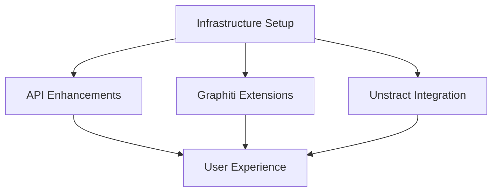

# 🗺️ Legal AI Agents Project Roadmap

## Overview
This document outlines the development roadmap for the Legal AI Agents project, organized by epics, priorities, and dependencies.

## 📊 Priority Levels
- **P0-critical**: Must have, blocks other work
- **P1-high**: Should have, important for core functionality  
- **P2-medium**: Nice to have, enhances user experience
- **P3-low**: Future consideration

## 🎯 Milestones

### Milestone 1: Foundation (Weeks 1-3)
**Goal**: Production-ready infrastructure and deployment

#### EPIC-001: Infrastructure Setup [P0-critical]
- [ ] Kubernetes Deployment Configuration
- [ ] GitHub Actions CI/CD Pipeline
- [ ] Monitoring and Observability Stack
- [ ] Centralized Logging System
- [ ] Backup and Recovery Strategy
- [ ] Security Hardening and SSL/TLS

### Milestone 2: API Excellence (Weeks 4-8)
**Goal**: Feature-complete and performant API

#### EPIC-002: Unified API Enhancements [P1-high]
- [ ] GraphQL API Implementation
- [ ] Advanced Caching Strategy
- [ ] Rate Limiting and Throttling
- [ ] API Versioning System
- [ ] Comprehensive Test Suite
- [ ] Client SDKs Development
- [ ] WebSocket Real-time Updates

### Milestone 3: Domain Expertise (Weeks 9-16)
**Goal**: Best-in-class legal AI capabilities

#### EPIC-003: Graphiti Legal Extensions [P1-high]
- [ ] Extended Legal Website Crawlers
- [ ] Advanced Legal Entity Types
- [ ] Legal Reasoning Engine
- [ ] Citation Network Analysis
- [ ] Compliance Checking Framework
- [ ] Document Similarity Algorithms
- [ ] Temporal Law Evolution

#### EPIC-004: Unstract Deep Integration [P2-medium]
- [ ] Workflow Creation API
- [ ] Legal Document Templates Library
- [ ] Workflow Recommendation Engine
- [ ] Batch Processing Optimization
- [ ] Multi-format Document Support
- [ ] Workflow Versioning System
- [ ] Pipeline Monitoring Dashboard

### Milestone 4: User Experience (Weeks 17-26)
**Goal**: Accessible and user-friendly interfaces

#### EPIC-005: User Experience and Frontend [P2-medium]
- [ ] Web Dashboard Development
- [ ] Interactive CLI Tool
- [ ] Mobile Application
- [ ] Browser Extension
- [ ] User Authentication System
- [ ] Saved Searches and Alerts
- [ ] Export and Reporting

## 📈 Progress Tracking

### Epic Status
| Epic | Priority | Status | Progress |
|------|----------|--------|----------|
| Infrastructure Setup | P0 | Planning | 0/6 |
| API Enhancements | P1 | Planning | 0/7 |
| Graphiti Extensions | P1 | Planning | 0/7 |
| Unstract Integration | P2 | Planning | 0/7 |
| User Experience | P2 | Planning | 0/7 |

### Dependency Graph

## 🚀 Quick Wins
These can be done in parallel with low effort:
1. Documentation improvements
2. Docker Compose optimizations
3. Basic CLI enhancements
4. Example scripts and tutorials
5. Bug fixes and small improvements

## 📅 Timeline Estimates
- **Phase 1** (Infrastructure): 3 weeks
- **Phase 2** (API): 5 weeks  
- **Phase 3** (Domain): 8 weeks
- **Phase 4** (UX): 10 weeks

**Total Timeline**: ~26 weeks (6 months)

## 🎓 Technical Debt Items
Track these for future sprints:
- Refactor authentication system
- Optimize database queries
- Improve error handling
- Add more comprehensive logging
- Performance profiling and optimization

## 📋 How to Use This Roadmap

1. **For Contributors**:
   - Check milestone goals
   - Pick issues from current milestone
   - Follow priority order
   - Check dependencies before starting

2. **For Project Managers**:
   - Track progress weekly
   - Adjust priorities based on feedback
   - Update milestone dates as needed
   - Communicate changes to team

3. **For Users**:
   - See what's coming next
   - Provide feedback on priorities
   - Suggest new features
   - Report bugs and issues