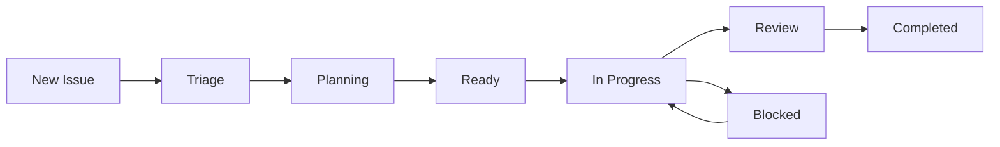

# 📋 Issue Tracking Guide

This guide explains how we manage issues, features, and bugs in the Legal AI Agents project.

## 🏗️ Issue Structure

### Issue Types

1. **Epic** - Large features or project components
   - Contains multiple features
   - Tracked in `.github/ISSUES/EPIC-*.md`
   - Labels: `epic`, priority label, component label

2. **Feature** - Specific functionality to implement
   - Part of an epic
   - Has clear acceptance criteria
   - Labels: `feature`, complexity label, component label

3. **Bug** - Something that's broken
   - Requires reproduction steps
   - Labels: `bug`, severity label, component label

4. **Enhancement** - Improvement to existing functionality
   - Not a new feature, but makes things better
   - Labels: `enhancement`, component label

5. **Task** - Simple work items
   - Usually subtasks of features
   - Labels: `task`, component label

## 🏷️ Label System

### Priority Labels
- `P0-critical` - Blocks other work, fix immediately
- `P1-high` - Important for core functionality
- `P2-medium` - Enhances user experience
- `P3-low` - Nice to have, future consideration

### Component Labels
- `graphiti` - Related to Graphiti integration
- `unstract` - Related to Unstract integration
- `unified-api` - API gateway related
- `infrastructure` - DevOps, deployment, monitoring
- `frontend` - UI/UX related
- `documentation` - Docs and guides

### Status Labels
- `planning` - In design phase
- `ready` - Ready to start work
- `in-progress` - Being actively worked on
- `blocked` - Waiting on something
- `review` - In code review
- `completed` - Done and merged

### Other Labels
- `good-first-issue` - Good for newcomers
- `help-wanted` - Need community help
- `wontfix` - Decided not to implement
- `duplicate` - Duplicate of another issue

## 📝 Issue Creation Process

### 1. Check Existing Issues
Before creating a new issue:
- Search existing issues (open and closed)
- Check the roadmap
- Look at related epics

### 2. Choose the Right Template
- Use issue templates in `.github/ISSUE_TEMPLATE/`
- Fill out all required sections
- Be specific and detailed

### 3. For New Features
1. Check if it fits an existing epic
2. If not, consider creating a new epic first
3. Link to parent epic
4. Break down into subtasks

### 4. For Bugs
1. Provide clear reproduction steps
2. Include environment details
3. Add screenshots/logs if applicable
4. Tag affected component

## 🔄 Issue Workflow



### States Explained

1. **New Issue**: Just created, needs triage
2. **Triage**: Team reviews and adds labels
3. **Planning**: Design and approach being decided
4. **Ready**: Clear plan, ready for implementation
5. **In Progress**: Someone is actively working on it
6. **Review**: Code complete, in review
7. **Completed**: Merged and deployed
8. **Blocked**: Waiting on dependencies

## 👥 Assignment Rules

1. **Self-Assignment**: 
   - Comment on the issue expressing interest
   - Wait for maintainer approval
   - Don't take more than 2 issues at once

2. **Maintainer Assignment**:
   - Based on expertise and availability
   - Considers workload balance

3. **Reassignment**:
   - If no progress in 2 weeks
   - If contributor requests it
   - If requirements change

## 📊 Progress Tracking

### At Issue Level
- Use task lists in issue description
- Update regularly as you progress
- Comment on blockers immediately

### At Epic Level
- Track in `.github/ISSUES/EPIC-*.md` files
- Update progress numbers
- Link completed features

### At Project Level
- See `PROJECT_ROADMAP.md`
- Weekly progress updates
- Milestone tracking

## 🔗 Linking Issues

### Parent-Child Relationships
```markdown
Epic: #001
Parent: #001
Blocks: #123
Depends on: #456
Related to: #789
```

### In Commits
```bash
git commit -m "feat: Add GraphQL endpoint

Implements GraphQL API for flexible querying

Closes #123
Part of #001"
```

### In Pull Requests
- Reference issues in PR description
- Use keywords: `Closes`, `Fixes`, `Resolves`
- Link to parent epic

## 📈 Metrics We Track

1. **Velocity**: Issues completed per week
2. **Cycle Time**: Time from start to completion
3. **Bug Rate**: Bugs reported vs fixed
4. **Coverage**: Test coverage percentage

## 🚀 Best Practices

### For Issue Creators
1. Search before creating
2. Use templates properly
3. Be specific and detailed
4. Add relevant labels
5. Link related issues

### For Contributors
1. Read the full issue before starting
2. Ask questions if unclear
3. Update progress regularly
4. Follow coding standards
5. Write tests

### For Maintainers
1. Triage new issues quickly
2. Keep labels updated
3. Close stale issues
4. Provide clear feedback
5. Recognize contributions

## 🆘 Getting Help

- **Questions**: Use GitHub Discussions
- **Bugs**: Create a bug issue
- **Features**: Create enhancement issue
- **General**: Comment on relevant issue

## 📅 Issue Cleanup

- **Stale Issues**: No activity for 30 days
- **Abandoned**: No response from assignee in 14 days
- **Invalid**: Doesn't follow templates or guidelines
- **Duplicate**: Already reported/fixed

Remember: Good issue tracking helps everyone collaborate effectively!