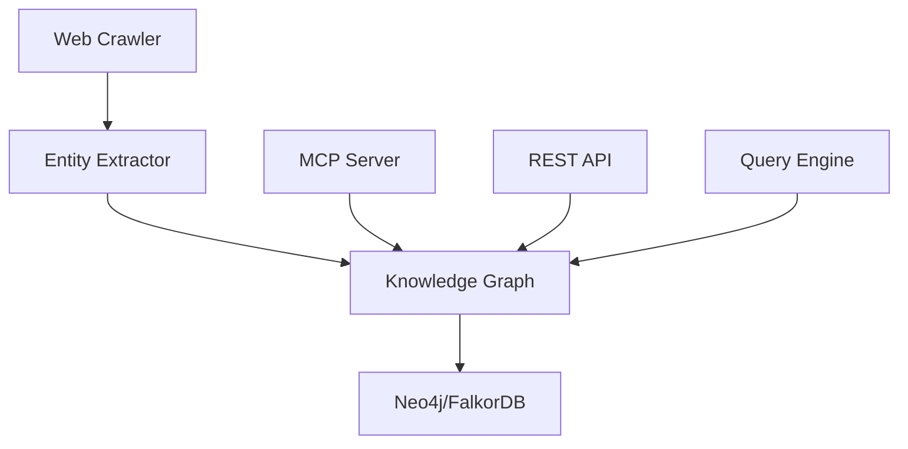
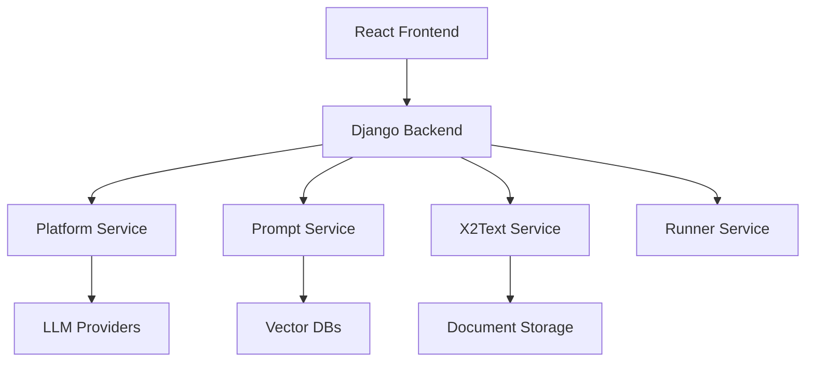

# 🏛️ Legal AI Agents for India

<div align="center">


<p align="center">
  <b>Advanced AI-powered legal document processing and knowledge graph solutions tailored for the Indian legal system</b>
</p>

[📚 Documentation](./Wiki/README.md) • 
[🚀 Getting Started](#-quick-start) • 
[🔧 Installation](./Wiki/01-Installation-Guide.md) • 
[🔑 Access Info](./Wiki/02-Access-Credentials.md) • 
[🤝 Contributing](#-contributing)

</div>

---

## 🌟 Overview

Legal AI Agents for India combines three powerful AI frameworks specifically designed for Indian legal domain applications:

### 🔮 **Graphiti** - Temporal Legal Knowledge Graph Framework
Build and query temporally-aware knowledge graphs for legal intelligence, case law analysis, and statutory interpretation.

### 📄 **Unstract** - No-Code Document Processing Platform
Enterprise-grade platform for intelligent document processing, data extraction, and automated legal document analysis.

### 🕸️ **Crawl4AI** - Intelligent Web Crawler (Integrated in Graphiti)
AI-powered web crawler for automated extraction of legal documents from Indian legal websites.

## 🌐 Access Information

### Production URLs
- **Unstract Platform**: http://docs.cynorsense.com:80
- **Unstract API**: http://docs.cynorsense.com:80/api/v2/
- **API Documentation**: http://docs.cynorsense.com:80/api/v2/swagger/

### Development URLs
- **Unstract Frontend**: http://localhost:3000
- **Unstract Backend**: http://localhost:8000
- **Graphiti API**: http://localhost:8001 (when running)

### Default Credentials
| Service | Username | Password |
|---------|----------|----------|
| PostgreSQL | unstract_dev | unstract_pass |
| Neo4j | neo4j | password |
| RabbitMQ | rabbitmq | rabbitmq |
| MinIO | minio | minio123 |

## ✨ Key Features

<table>
<tr>
<td width="50%">

### 🔮 Graphiti Features

- 🏛️ **Indian Legal Entity Recognition**
  - CaseLaw, Statute, LegalPrinciple
  - CyberIncident, LegalConcept
  - Custom entity types

- 🌐 **Automated Web Crawling**
  - Indian Kanoon
  - Supreme Court of India
  - MeitY, CIS India, SFLC.in

- ⏰ **Bi-Temporal Tracking**
  - Event occurrence time
  - Processing time
  - Historical accuracy

- 🔍 **Advanced Legal Analysis**
  - Case-to-Law mapping
  - Precedent analysis
  - Compliance mapping

</td>
<td width="50%">

### 📄 Unstract Features

- 🎨 **No-Code Prompt Studio**
  - Visual prompt builder
  - Multi-model support
  - Real-time preview

- 🔄 **Multi-Service Architecture**
  - Scalable microservices
  - Container orchestration
  - Hot reloading

- 🔌 **Extensive Integrations**
  - 7+ LLM providers
  - 5+ Vector databases
  - 15+ ETL connectors

- 🛡️ **Enterprise Security**
  - Multi-tenant architecture
  - API key authentication
  - Encrypted storage

</td>
</tr>
</table>

## 🚀 Quick Start

### Prerequisites

- Python 3.10+
- Docker & Docker Compose
- Node.js 16+ (for Unstract frontend)
- Neo4j or FalkorDB (for Graphiti)

### 🔮 Start Graphiti

```bash
# Clone the repository
git clone https://github.com/Cyarun/Legal-AI-Agents-IND.git
cd Legal-AI-Agents-IND/graphiti

# Install dependencies
pip install uv
uv sync

# Start services
docker-compose up -d

# Run tests
make test

# Start the REST API
cd server && uvicorn graph_service.main:app --reload
```

### 📄 Start Unstract

```bash
cd Legal-AI-Agents-IND/unstract

# Quick start with Docker
./run-platform.sh

# Access the platform
# Frontend: http://docs.cynorsense.com:80 (via Traefik proxy)
# Backend API: http://docs.cynorsense.com:80/api/v2/ (proxied to port 8000)
# API Docs: http://docs.cynorsense.com:80/api/v2/swagger/
# Direct ports (for development):
#   - Frontend: http://localhost:3000
#   - Backend: http://localhost:8000
```

## 🔧 Installation

<details>
<summary><b>📋 Detailed Installation Guide</b></summary>

### Graphiti Installation

1. **Set up environment variables**
   ```bash
   export OPENAI_API_KEY="your-api-key"
   export NEO4J_URI="bolt://localhost:7687"
   export NEO4J_USER="neo4j"
   export NEO4J_PASSWORD="password"
   ```

2. **Install dependencies**
   ```bash
   cd graphiti
   pip install uv
   uv sync
   ```

3. **Start graph database**
   ```bash
   docker-compose up -d neo4j
   ```

### Unstract Installation

1. **Configure environment**
   ```bash
   cd unstract
   cp docker/.env.example docker/.env
   ```

2. **Start all services**
   ```bash
   ./run-platform.sh
   ```

3. **Development setup**
   ```bash
   # Backend
   ./dev-env-cli.sh -e -s backend
   ./dev-env-cli.sh -a -s backend
   ./dev-env-cli.sh -i -s backend

   # Frontend
   cd frontend
   npm install
   npm start
   ```

</details>

## 🔄 Current System Status

### ✅ Unstract - RUNNING
- All services operational at http://docs.cynorsense.com:80
- Backend, Frontend, and all microservices running
- Accessible via Traefik proxy on port 80

### ⚠️ Graphiti - NOT RUNNING
- Services not started
- Requires `.env` configuration
- Neo4j/FalkorDB needs to be started

### 🕸️ Crawl4AI - INTEGRATED
- Built into Graphiti at `graphiti/graphiti_core/utils/web_crawler.py`
- Requires Graphiti to be running to access
- Supports Indian legal websites

## 🎯 Unified API Approach (Planned)

For a unified API server integrating all three systems, see [Unified API Design](./Wiki/05-Unified-API-Design.md).

### Quick Integration Status:
- **Crawl4AI ↔ Graphiti**: ✅ Already integrated
- **Graphiti ↔ Unstract**: ⚠️ Can be integrated via API
- **Unified API Server**: 📋 Design available

## 📊 Architecture

<details>
<summary><b>🏗️ System Architecture</b></summary>

### Graphiti Architecture


### Unstract Architecture


</details>

## 🎯 Use Cases

<table>
<tr>
<td width="33%">

### 📋 Legal Research
- Case law analysis
- Statutory interpretation
- Precedent mapping

</td>
<td width="33%">

### 📑 Document Processing
- Contract analysis
- Compliance checking
- Information extraction

</td>
<td width="33%">

### 🔒 Cyber Law
- IT Act compliance
- Data protection
- Privacy regulations

</td>
</tr>
</table>

## 🛠️ Technology Stack

<div align="center">


</div>

## 📸 Screenshots

<details>
<summary><b>🖼️ Platform Screenshots</b></summary>

### Unstract Prompt Studio


### Graphiti Knowledge Graph


</details>

## 🤝 Contributing

We welcome contributions! Please see our [Contributing Guidelines](CONTRIBUTING.md) for details.

### How to Contribute

1. Fork the repository
2. Create your feature branch (`git checkout -b feature/AmazingFeature`)
3. Commit your changes (`git commit -m 'Add some AmazingFeature'`)
4. Push to the branch (`git push origin feature/AmazingFeature`)
5. Open a Pull Request

## 📚 Documentation

- 📖 [Full Documentation Wiki](./Wiki/README.md)
- 🚀 [Installation Guide](./Wiki/01-Installation-Guide.md)
- 🔑 [Access & Credentials](./Wiki/02-Access-Credentials.md)
- 🏗️ [Architecture Overview](./Wiki/03-Architecture.md)
- 🕸️ [Graphiti & Crawl4AI Guide](./Wiki/04-Graphiti-Crawl4AI-Guide.md)

## 🔒 Security

Security is our top priority. Please review our [Security Policy](SECURITY.md) for reporting vulnerabilities.

### Security Features
- 🔐 API key authentication
- 🏢 Multi-tenant architecture
- 🔒 Encrypted credential storage
- 📊 Rate limiting and monitoring

## 📊 Project Status

<div align="center">


</div>

## 🙏 Acknowledgments

- Indian legal community for domain expertise
- Open source contributors
- LLM providers for AI capabilities

## 📄 License

This project is licensed under the MIT License - see the [LICENSE](LICENSE) file for details.

---

<div align="center">

**Made with ❤️ for the Indian Legal Community**

[Report Bug](https://github.com/Cyarun/Legal-AI-Agents-IND/issues) • 
[Request Feature](https://github.com/Cyarun/Legal-AI-Agents-IND/issues) • 
[Join Discussion](https://github.com/Cyarun/Legal-AI-Agents-IND/discussions)

</div>