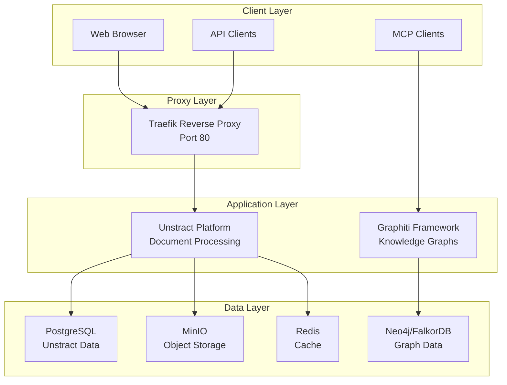
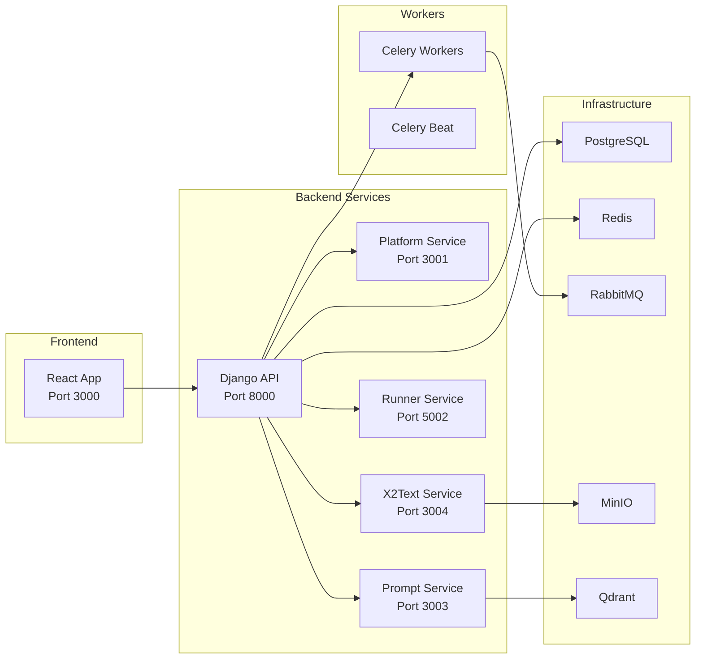
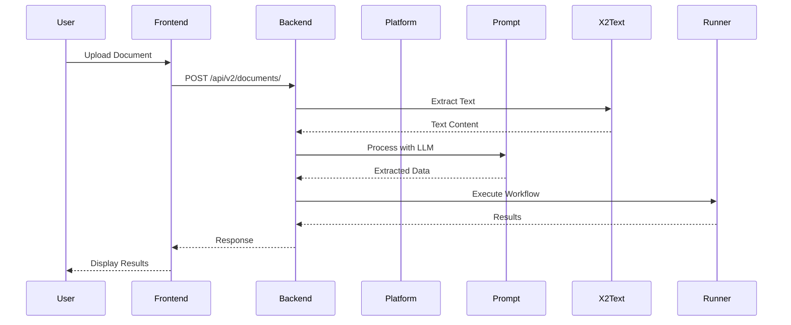
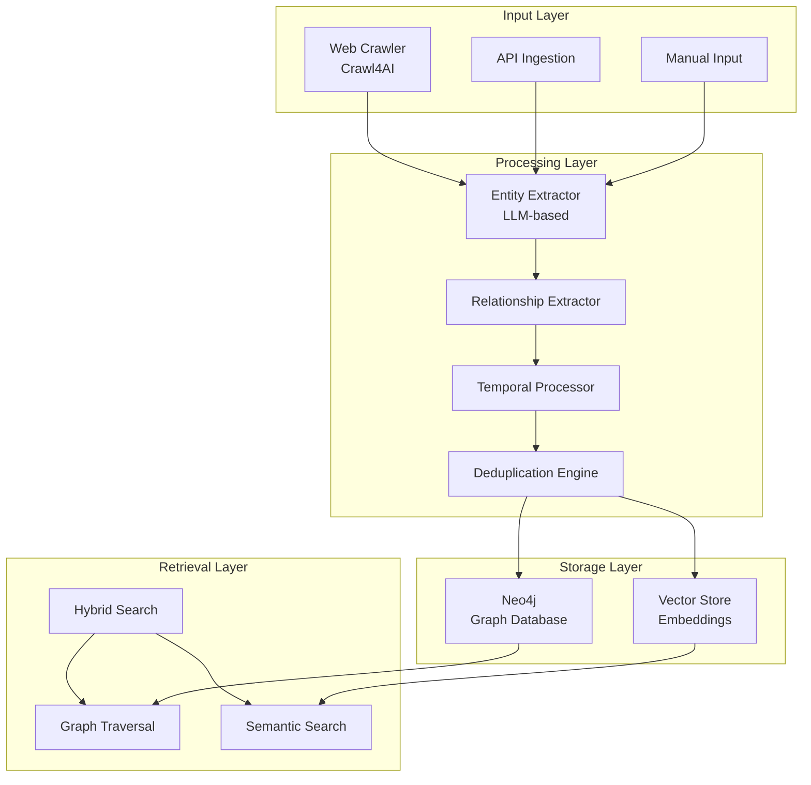
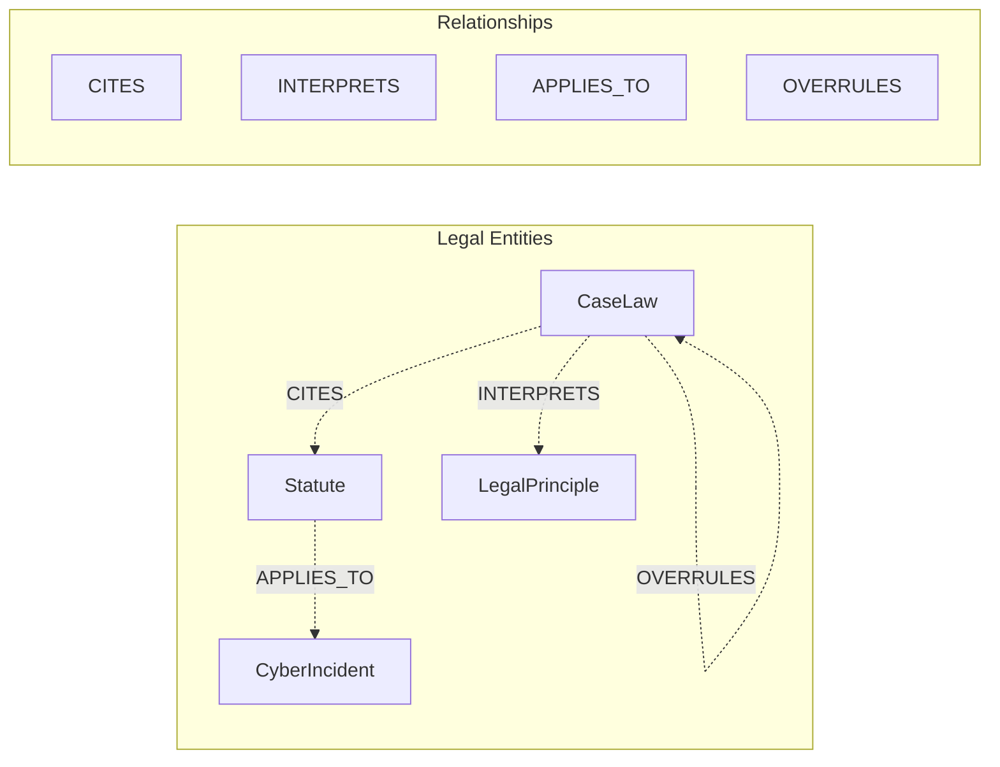
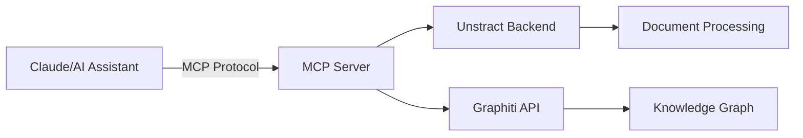
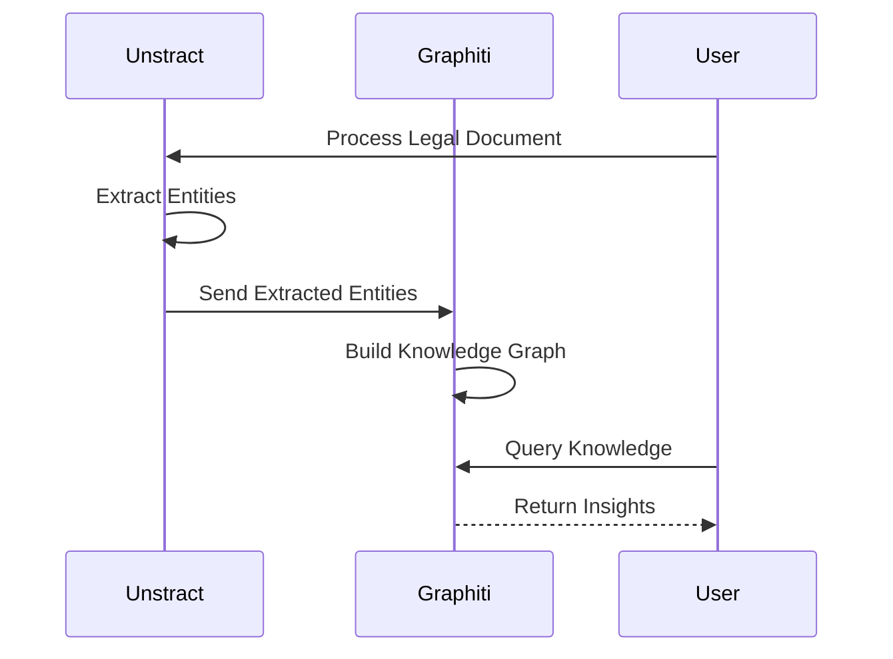
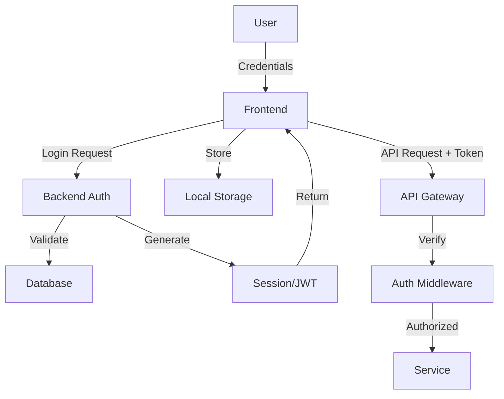
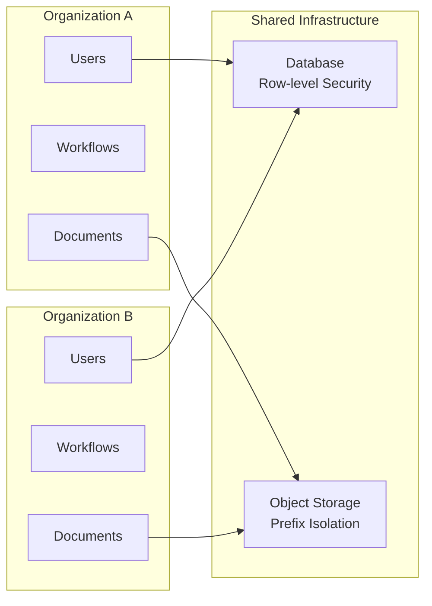

# 🏗️ System Architecture Overview

## Table of Contents
- [High-Level Architecture](#high-level-architecture)
- [Unstract Architecture](#unstract-architecture)
- [Graphiti Architecture](#graphiti-architecture)
- [Integration Points](#integration-points)
- [Data Flow](#data-flow)
- [Security Architecture](#security-architecture)

## High-Level Architecture



## Unstract Architecture

### Component Overview



### Service Responsibilities

#### 1. Frontend (React)
- **Purpose**: User interface for document processing workflows
- **Key Features**:
  - Workflow builder with drag-and-drop
  - Prompt Studio for testing
  - API deployment interface
  - Document viewer

#### 2. Backend API (Django)
- **Purpose**: Core business logic and API gateway
- **Key Features**:
  - Multi-tenant architecture
  - Authentication & authorization
  - Workflow management
  - API key management
  - MCP integration endpoints

#### 3. Platform Service
- **Purpose**: Adapter lifecycle management
- **Responsibilities**:
  - LLM adapter registration
  - Embedding model management
  - Vector DB connector management
  - Credential encryption/decryption

#### 4. Prompt Service
- **Purpose**: AI-powered document processing
- **Responsibilities**:
  - Document indexing
  - Semantic search
  - Prompt optimization
  - Response generation

#### 5. X2Text Service
- **Purpose**: Document text extraction
- **Supported Formats**:
  - PDF (with OCR)
  - DOCX, XLSX, PPTX
  - Images (PNG, JPG)
  - HTML, TXT

#### 6. Runner Service
- **Purpose**: Workflow execution engine
- **Features**:
  - Docker container spawning
  - Tool isolation
  - Resource management
  - Execution monitoring

### Data Flow in Unstract



## Graphiti Architecture

### Core Components



### Key Components

#### 1. Web Crawler (Crawl4AI Integration)
- **Location**: `graphiti_core/utils/web_crawler.py`
- **Features**:
  - Legal website extraction strategies
  - LLM-based content extraction
  - CSS selector strategies for structured sites
  - Metadata extraction (dates, citations)

#### 2. Entity Extraction Pipeline
- **LLM-Powered**: Uses OpenAI/Anthropic for extraction
- **Entity Types**:
  - CaseLaw
  - Statute
  - LegalPrinciple
  - CyberIncident
  - LegalConcept
  - Custom entities via Pydantic

#### 3. Temporal Model
- **Bi-Temporal Tracking**:
  - `valid_from/valid_to`: Event occurrence time
  - `created_at/expired_at`: Database record time
- **Enables**:
  - Historical queries
  - Point-in-time analysis
  - Audit trails

#### 4. Search Architecture
```python
# Hybrid search configuration
search_config = SearchConfig(
    include_semantic_similarity=True,
    include_text_similarity=True,
    include_node_summary=True,
    temporal_config=TemporalConfig(
        valid_at="2024-01-01"
    )
)
```

### Graph Schema



## Integration Points

### 1. MCP (Model Context Protocol) Integration



**Unstract MCP Features**:
- Document upload/download
- Workflow execution
- Prompt testing
- Results retrieval

**Graphiti MCP Features**:
- Knowledge graph queries
- Entity creation
- Relationship mapping
- Temporal queries

### 2. API Integration

#### Unstract API Structure
```
http://docs.cynorsense.com:80/
├── /api/v2/
│   ├── /auth/              # Authentication
│   ├── /organizations/     # Multi-tenancy
│   ├── /workflows/         # Workflow management
│   ├── /adapters/          # LLM/VectorDB adapters
│   ├── /prompt-studio/     # Prompt engineering
│   └── /documents/         # Document management
└── /deployment/{api_key}/  # Deployed workflows
```

#### Graphiti API Structure
```
http://localhost:8001/
├── /ingest/               # Data ingestion
├── /retrieve/             # Knowledge retrieval
├── /search/               # Hybrid search
├── /entities/             # Entity management
└── /relationships/        # Relationship queries
```

### 3. Data Exchange



## Security Architecture

### 1. Authentication Flow



### 2. Multi-Tenant Isolation



### 3. Security Layers

1. **Network Security**
   - Traefik reverse proxy
   - TLS termination
   - Rate limiting

2. **Application Security**
   - JWT/Session authentication
   - RBAC authorization
   - API key management
   - CSRF protection

3. **Data Security**
   - Encryption at rest
   - Encrypted credentials
   - Secure key storage
   - Audit logging

## Performance Considerations

### 1. Caching Strategy
- **Redis**: Session cache, query cache
- **Application Cache**: LLM response caching
- **CDN**: Static asset caching

### 2. Scaling Architecture
```yaml
# Horizontal scaling example
services:
  worker:
    scale: 5  # Scale workers
  
  backend:
    deploy:
      replicas: 3  # Multiple backend instances
```

### 3. Resource Optimization
- Celery autoscaling for workers
- Connection pooling for databases
- Lazy loading for large documents
- Streaming responses for large datasets

## Monitoring and Observability

### 1. Service Health
- Health check endpoints for each service
- Docker health checks
- Prometheus metrics export

### 2. Logging Architecture
```
Service Logs --> Celery Worker --> PostgreSQL
                      |
                      v
                 Log Aggregation
```

### 3. Performance Metrics
- Request/response times
- Queue lengths
- Resource utilization
- Error rates

## Next Steps
- [API Documentation](./04-API-Documentation.md)
- [Deployment Guide](./05-Deployment.md)
- [Performance Tuning](./06-Performance.md)