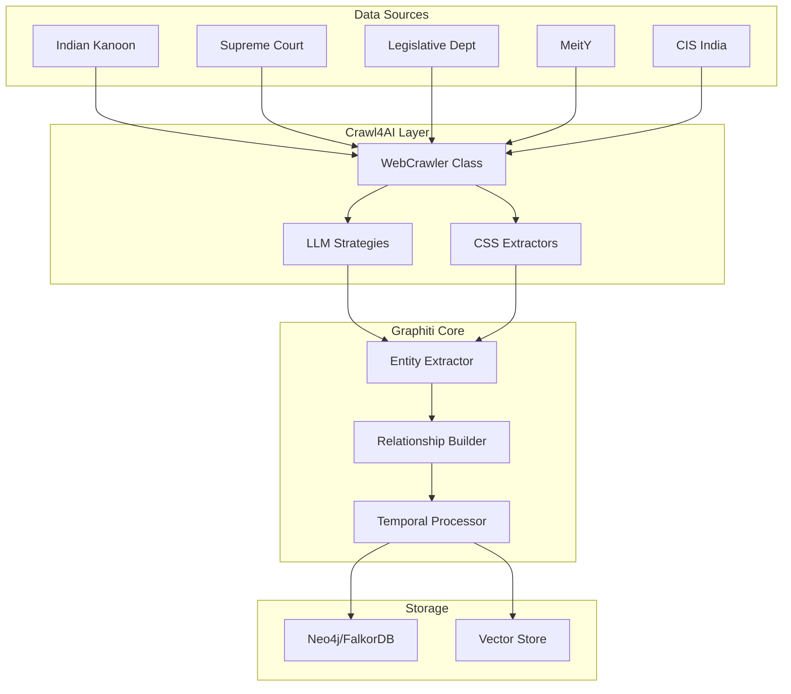

# 🕸️ Graphiti & Crawl4AI Integration Guide

## Table of Contents
- [Overview](#overview)
- [Architecture](#architecture)
- [Crawl4AI Integration](#crawl4ai-integration)
- [Legal Entity Extraction](#legal-entity-extraction)
- [Usage Examples](#usage-examples)
- [Configuration](#configuration)
- [Best Practices](#best-practices)

## Overview

Graphiti is a temporal knowledge graph framework that integrates with Crawl4AI for automated extraction of legal information from Indian legal websites. This integration enables:

- Automated legal document crawling
- AI-powered entity extraction
- Temporal knowledge graph construction
- Legal relationship mapping

## Architecture

### Component Interaction



## Crawl4AI Integration

### Location
`graphiti/graphiti_core/utils/web_crawler.py`

### Key Features

#### 1. WebCrawler Class
```python
class WebCrawler:
    """Advanced web crawler for legal document extraction"""
    
    def __init__(
        self,
        llm_provider: str = "openai",
        model: str = "gpt-4",
        api_key: Optional[str] = None,
        verbose: bool = False
    ):
        # Initializes with LLM for intelligent extraction
```

#### 2. Supported Legal Websites

```python
LEGAL_SITE_CONFIGS = {
    "indiankanoon.org": {
        "name": "Indian Kanoon",
        "type": "case_law_database",
        "extraction_strategy": "css_selectors",
        "selectors": {
            "title": "h1.doc-title",
            "content": "div.judgments",
            "citation": "div.docsource_main",
            "date": "span.date"
        }
    },
    "sci.gov.in": {
        "name": "Supreme Court of India",
        "type": "official_court",
        "extraction_strategy": "llm_extraction"
    },
    # ... more configurations
}
```

#### 3. Extraction Strategies

**LLM-Based Extraction**:
```python
async def extract_legal_info(
    self,
    url: str,
    extract_type: str = "judgment",
    custom_schema: Optional[Dict] = None
) -> Dict[str, Any]:
    """Extract structured legal information using LLM"""
```

**CSS Selector Strategy**:
```python
def _apply_css_strategy(
    self,
    html_content: str,
    config: Dict[str, Any]
) -> Dict[str, Any]:
    """Extract using predefined CSS selectors"""
```

## Legal Entity Extraction

### Supported Entity Types

```python
class LegalEntityType(str, Enum):
    CASE_LAW = "CaseLaw"
    STATUTE = "Statute"
    LEGAL_PRINCIPLE = "LegalPrinciple"
    CYBER_INCIDENT = "CyberIncident"
    LEGAL_CONCEPT = "LegalConcept"
    REGULATION = "Regulation"
    POLICY = "Policy"
```

### Entity Schema Examples

#### CaseLaw Entity
```python
class CaseLaw(BaseNode):
    case_name: str
    citation: str
    court: str
    date_decided: datetime
    judges: List[str]
    summary: str
    legal_issues: List[str]
    decision: str
    precedents_cited: List[str]
```

#### Statute Entity
```python
class Statute(BaseNode):
    title: str
    act_number: str
    year_enacted: int
    sections: List[Dict[str, str]]
    amendments: List[Dict[str, Any]]
    jurisdiction: str
    effective_date: datetime
```

## Usage Examples

### Basic Crawling and Extraction

```python
from graphiti_core.utils.web_crawler import WebCrawler
from graphiti import Graphiti
import asyncio

async def extract_case_law():
    # Initialize crawler
    crawler = WebCrawler(
        llm_provider="openai",
        api_key="your-openai-key"
    )
    
    # Extract case information
    case_data = await crawler.extract_legal_info(
        url="https://indiankanoon.org/doc/12345/",
        extract_type="judgment"
    )
    
    # Initialize Graphiti
    graphiti = Graphiti(
        neo4j_uri="bolt://localhost:7687",
        neo4j_user="neo4j",
        neo4j_password="password"
    )
    
    # Add to knowledge graph
    await graphiti.add_episode(
        name=case_data['case_name'],
        episode_body=case_data['content'],
        source_description="Indian Kanoon Case Law"
    )

# Run extraction
asyncio.run(extract_case_law())
```

### Bulk Legal Document Processing

```python
async def process_legal_documents(urls: List[str]):
    crawler = WebCrawler(llm_provider="openai")
    graphiti = Graphiti()
    
    for url in urls:
        try:
            # Determine extraction type
            if "indiankanoon.org" in url:
                extract_type = "judgment"
            elif "legislative.gov.in" in url:
                extract_type = "statute"
            else:
                extract_type = "general"
            
            # Extract data
            data = await crawler.extract_legal_info(
                url=url,
                extract_type=extract_type
            )
            
            # Add to graph with temporal information
            await graphiti.add_episode(
                name=data.get('title', 'Untitled'),
                episode_body=json.dumps(data),
                source_description=f"Extracted from {url}",
                timestamp=data.get('date', datetime.now())
            )
            
        except Exception as e:
            print(f"Error processing {url}: {e}")
```

### Custom Entity Extraction

```python
# Define custom schema for cyber law cases
cyber_law_schema = {
    "case_name": "string",
    "cyber_crime_type": "string",
    "it_act_sections": "array",
    "data_breach_details": "object",
    "penalty_imposed": "string"
}

# Extract with custom schema
cyber_case = await crawler.extract_legal_info(
    url="https://example.com/cyber-case",
    extract_type="judgment",
    custom_schema=cyber_law_schema
)
```

## Configuration

### Environment Setup

```bash
# Required environment variables
export OPENAI_API_KEY="your-key"
export NEO4J_URI="bolt://localhost:7687"
export NEO4J_USER="neo4j"
export NEO4J_PASSWORD="password"

# Optional crawl4ai settings
export CRAWLER_USER_AGENT="LegalAI/1.0"
export CRAWLER_TIMEOUT=30
export CRAWLER_MAX_RETRIES=3
```

### Graphiti Configuration

```python
from graphiti import Graphiti
from graphiti_core.llm_client import OpenAIClient
from graphiti_core.embedder import OpenAIEmbedder

# Initialize with custom configuration
graphiti = Graphiti(
    neo4j_uri="bolt://localhost:7687",
    neo4j_user="neo4j",
    neo4j_password="password",
    llm_client=OpenAIClient(model="gpt-4"),
    embedder=OpenAIEmbedder(model="text-embedding-3-small")
)
```

### Crawl4AI Advanced Settings

```python
# Advanced crawler configuration
crawler = WebCrawler(
    llm_provider="openai",
    model="gpt-4",
    api_key="your-key",
    verbose=True,
    config={
        "timeout": 30,
        "max_retries": 3,
        "user_agent": "LegalAI Bot",
        "follow_redirects": True,
        "verify_ssl": True
    }
)
```

## Best Practices

### 1. Rate Limiting
```python
import time

async def crawl_with_rate_limit(urls: List[str], delay: float = 1.0):
    crawler = WebCrawler()
    results = []
    
    for url in urls:
        result = await crawler.extract_legal_info(url)
        results.append(result)
        time.sleep(delay)  # Respect server rate limits
    
    return results
```

### 2. Error Handling
```python
async def safe_extraction(url: str) -> Optional[Dict]:
    crawler = WebCrawler()
    
    try:
        return await crawler.extract_legal_info(url)
    except RateLimitError:
        await asyncio.sleep(60)  # Wait before retry
        return await safe_extraction(url)
    except ExtractionError as e:
        logger.error(f"Extraction failed for {url}: {e}")
        return None
```

### 3. Data Validation
```python
def validate_legal_entity(data: Dict) -> bool:
    """Validate extracted legal entity data"""
    required_fields = ['title', 'date', 'content']
    
    for field in required_fields:
        if field not in data or not data[field]:
            return False
    
    # Additional validation
    if 'date' in data:
        try:
            datetime.fromisoformat(data['date'])
        except:
            return False
    
    return True
```

### 4. Batch Processing
```python
async def batch_process_legal_docs(
    urls: List[str],
    batch_size: int = 10
) -> List[Dict]:
    crawler = WebCrawler()
    graphiti = Graphiti()
    
    results = []
    for i in range(0, len(urls), batch_size):
        batch = urls[i:i + batch_size]
        
        # Process batch concurrently
        tasks = [
            crawler.extract_legal_info(url)
            for url in batch
        ]
        batch_results = await asyncio.gather(*tasks)
        
        # Add to graph
        for result in batch_results:
            if result:
                await graphiti.add_episode(
                    name=result['title'],
                    episode_body=json.dumps(result)
                )
        
        results.extend(batch_results)
    
    return results
```

## Query Examples

### Finding Related Cases
```python
# Search for cases citing IT Act Section 66A
results = await graphiti.search(
    query="IT Act Section 66A constitutional validity",
    config=SearchConfig(
        include_semantic_similarity=True,
        include_text_similarity=True,
        entity_types=["CaseLaw"],
        limit=10
    )
)
```

### Temporal Queries
```python
# Get all cyber law cases from 2020
results = await graphiti.search(
    query="cyber crime data protection",
    config=SearchConfig(
        temporal_config=TemporalConfig(
            valid_from="2020-01-01",
            valid_to="2020-12-31"
        ),
        entity_types=["CaseLaw", "CyberIncident"]
    )
)
```

### Building Legal Networks
```python
# Extract network of related cases
case_network = await graphiti.get_neighbors(
    node_id="case_123",
    edge_types=["CITES", "OVERRULES", "DISTINGUISHES"],
    depth=2
)
```

## Troubleshooting

### Common Issues

1. **SSL Certificate Errors**
   ```python
   # Disable SSL verification (not recommended for production)
   crawler = WebCrawler(config={"verify_ssl": False})
   ```

2. **Timeout Issues**
   ```python
   # Increase timeout
   crawler = WebCrawler(config={"timeout": 60})
   ```

3. **LLM Rate Limits**
   ```python
   # Use exponential backoff
   from tenacity import retry, wait_exponential
   
   @retry(wait=wait_exponential(multiplier=1, min=4, max=10))
   async def extract_with_retry(url):
       return await crawler.extract_legal_info(url)
   ```

## Next Steps
- [API Documentation](./04-API-Documentation.md)
- [Performance Optimization](./06-Performance.md)
- [Legal Entity Reference](./07-Legal-Entities.md)